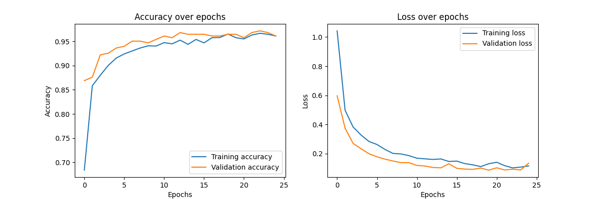

# VOC-Detector

Our project aims to develop a cost-effective, real-time VOC detection and classification system using affordable CCS811 and BME280 sensors interfaced with an Arduino. This system employs machine learning to classify VOCs in various environments, enhancing monitoring and safety applications. The goal is to provide continuous analysis of air quality, making it accessible and practical for widespread use in many applications.

The data we trained our model on is sensor data collected from various sources of VOCs.  The sensor input captured using an Arduino with the CCS811 and BME280 sensors is sent over serial to a python script on a computer which graphs the data and saves it to a csv.  The columns in the csv are timestamp, CO2, TVOC, temperature, pressure, and humidity.  We added a label column for manually labeling the data.  We collected data for live classification using the same setup except the data is preprocessed in windows and sent into the trained model for classification.  

We test our model by exposing the sensor to a specific source of VOCs and the terminal output from the python file will show the model’s output.  If the classification is correct and responds quickly to changes the test is successful.  Most of our tests correctly classified the substance but had trouble with not detecting it when it was removed.  This is likely because the sensor has a slow reaction time to some of the measurements such as temperature and humidity.  

One problem we face is noise in the sensor data, external influences have too much impact on our accuracy.  Our input data has several metrics other than VOCs and all of them are used in training, in the future we could simplify the data by removing extra sensor data that doesn’t help classification.  Another direction we could go is to put the model on an Arduino using a TFLITE.


## Training Results
<p align="center">
  
</p>

## Usage

### Training the model:

1. Add the desired training data to `model.py` following this example

```
file_paths = [
    'data/labeled/ambient1.csv',
    'data/labeled/ambient2.csv',
    'data/labeled/ambient3.csv',
    'data/labeled/breathing1.csv'
]
```

2. Train the model:

```
$ python3 model.py
```

3. This script saves the model and the label encodings for use in the live model

### Using the live model

1. Upload `sensor.ino` to an arduino

2. When the arduino is running and connected, replace the serial port in `readSerial.py` with the one the arduino is on

```
ser = serial.Serial('/dev/cu.usbmodem11401', 9600)
```

3. Run the model

```
$ python3 realTimeModel.py
```

4. The classification is output to the command line.

### Collecting new training data:
New training data can be collected by following this protocol.  Data must be labeled before it is used in the training script.

1. Upload `sensor.ino` to an arduino.

2. When the arduino is running and connected, replace the serial port in `readSerial.py` with the one the arduino is on.

```
ser = serial.Serial('/dev/cu.usbmodem11401', 9600)
```

3. Run the data collection script

```
$ python3 readSerial.py
```

4. Sensor data is displayed in a graph and is saved to a csv.  Data collection stops when the graph window is closed.

<p align="center">
  
</p>

Label column must be added like this:
```
Timestamp,CO2,TVOC,Temperature,Pressure,Humidity,Label
4/25/24 12:19,1150,114,80.6,75856.1,29,AmbientInside
```

## Circuit Setup

<p align="center">
  
</p>